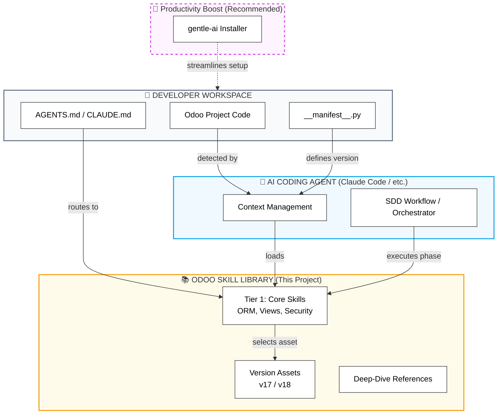
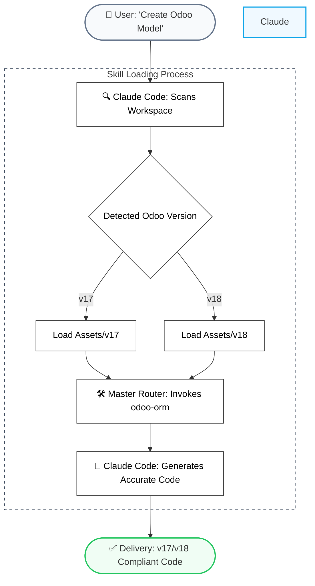

# PRD: Odoo Skills Ecosystem

> **Every Odoo version. Every module. Every AI assistant. One skill library — and your AI codes Odoo like a senior developer.**

**Version**: 0.2.0
**Author**: [Geraldow](https://github.com/Geraldow)
**Date**: 2026-03-14
**Status**: Draft

---

## 1. Problem Statement

Odoo development in 2026 is increasingly done with AI coding assistants (Claude Code, Gemini, Cursor, Copilot, etc.). But there's a critical gap:

**AI assistants know Python. They DON'T know Odoo.**

A raw AI assistant will:
- Use `name_get()` in Odoo 18 (deprecated since v17 — breaks silently)
- Write `attrs="{'invisible': [('state', '!=', 'draft')]}"` in v17+ (removed — hard crash)
- Put `type="json"` in a controller route (renamed to `type="jsonrpc"` in v17)
- Create `mail.channel` records (renamed to `discuss.channel` in v17)
- Ignore OCA conventions (wrong naming, missing license, wrong version format)
- Skip security rules entirely (no `ir.model.access.csv`, no `ir.rule`)
- Generate monolithic modules instead of modular, upgrade-safe code

**The result**: Code that looks correct but **fails on the target Odoo version**, violates conventions, skips security, and creates technical debt.

**This project eliminates that gap.** We create a complete **AI Skills Ecosystem for Odoo development** — a library of structured knowledge that any AI assistant can load to write correct, version-aware, convention-following Odoo code.

### Why now?

- Developers use Odoo 17 and 18 primarily (with 16 and 19 scheduled for later phases)
- Every developer uses (or will use) AI coding assistants
- SDD (Spec-Driven Development) workflow is already in place — skills plug in naturally
- Prowler proved this pattern works: their 36 AI skills transformed how their team develops

---

## 2. Vision

**A complete AI skills library that makes any coding assistant a senior Odoo developer — aware of version differences, OCA conventions, security patterns, and every corner of the Odoo stack.**

**Before**: "Claude/Gemini/Copilot writes Python, but I have to fix every Odoo-specific thing manually."

**After**: The AI detects `__manifest__.py` → loads the right skills → writes correct Odoo code for the target version → follows OCA conventions → includes security rules → creates proper tests.

### 2.1 Recommended Workflow Improvement
While **odoo-skills** is a fully independent open-source project, it is compatible with the **[gentle-ai](https://github.com/Gentleman-Programming/gentle-ai)** community installer. Using `gentle-ai` is recommended for developers who want to automate the installation process and integrate these skills into their daily workflow more efficiently, potentially saving significant man-hours by streamlining environment setup.

**This is NOT:**
- ❌ An Odoo module or addon
- ❌ A security scanner or auditor
- ❌ A replacement for learning Odoo
- ❌ A code generator tool

**This IS:**
- ✅ A skill library (Markdown files) that AI assistants read
- ✅ An AGENTS.md routing system (auto-invoke tables)
- ✅ A setup script (deploy to any AI tool)
- ✅ A sync system (keep everything connected)
- ✅ Version-aware (Primary: v17, v18 | Roadmap: v16, v19)

---

## 3. Target Users

### Primary
- **Odoo developers** using AI coding assistants (any level)
- **Development teams** that need standardized AI-assisted Odoo development
- **Companies** with projects in Odoo v17 and v18 (primary focus)

### Secondary
- **OCA contributors** who want AI assistance that follows OCA conventions
- **Odoo consultants** implementing projects on various client versions
- **Students** learning Odoo development with AI guidance

---

## 4. The Odoo Module

### Understanding the Scope

Odoo has **20+ major applications** that define the system's architecture:

| Application       | Modules                                            | Models | Complexity |
| ----------------- | -------------------------------------------------- | ------ | ---------- |
| **Framework**     | `base`, `web`, `web_studio`, `web_mobile`          | ~440   | Critical   |
| **Accounting**    | `account`, `account_reports`, `account_accountant` | ~310   | Critical   |
| **Communication** | `mail`, `discuss`, `whatsapp`, `sms`               | ~247   | High       |
| **Inventory**     | `stock`, `stock_picking_batch`, `delivery`         | ~150   | High       |
| **Point of Sale** | `point_of_sale`, `pos_loyalty`, `pos_self_order`   | ~140   | High       |
| **HR - Core**     | `hr`, `hr_contract`, `hr_payroll`, `hr_sign`       | ~145   | High       |
| **Website**       | `website`, `website_generator`, `website_studio`   | ~125   | Medium     |
| **Manufacturing** | `mrp`, `mrp_workorder`, `mrp_plm`                  | ~105   | High       |
| **Services**      | `project`, `industry_fsm`, `project_forecast`      | ~100   | Medium     |
| **Productivity**  | `knowledge`, `sign`, `approvals`, `calendar`       | ~95    | Medium     |
| **eCommerce**     | `website_sale`, `payment`                          | ~90    | High       |
| **Sales**         | `sale`, `sale_subscription`, `sale_renting`        | ~80    | Medium     |
| **Operations**    | `fleet`, `maintenance`, `planning`, `appointment`  | ~75    | Low/Medium |
| **Marketing**     | `mass_mailing`, `marketing_automation`, `social`   | ~70    | Medium     |
| **Talent**        | `hr_recruitment`, `hr_appraisal`, `hr_referral`    | ~65    | Medium     |
| **Purchase**      | `purchase`, `purchase_stock`                       | ~50    | Medium     |
| **Documents**     | `documents`, `documents_spreadsheet`               | ~47    | Medium     |
| **Helpdesk**      | `helpdesk`, `helpdesk_timesheet`                   | ~40    | Medium     |
| **CRM**           | `crm`, `crm_iap_mine`                              | ~40    | Low/Medium |
| **Tools**         | `data_cleaning`, `data_recycle`                    | ~35    | Low        |

**Final Consolidation: ~800 audited modules and ~4,200 models in a full professional ecosystem.**

### 4.3 Module Requirements

- **R-MOD-01**: The skill library MUST provide domain-specific knowledge for all 20+ applications listed in the Module Table.
- **R-MOD-02**: Complex areas (Accounting, Manufacturing, HR) MUST have dedicated "Deep Dive" references in the `references/` directory.
- **R-MOD-03**: The ecosystem MUST detect dependencies between modules (e.g., `sale` → `account`) and suggest loading cross-domain skills.
- **R-MOD-04**: Every app listed in the table MUST be mapped to at least one Skill (Core or Tier 6).

### Critical Insight: Skills ≠ Modules

> **We don't create one skill per Odoo module.** That would be 100+ skills and unmaintainable.
> Instead, we create skills around **development domains** (ORM, Views, Security, etc.) that apply **across ALL modules**.

```
❌ WRONG:  skills/odoo-sale/, skills/odoo-crm/, skills/odoo-hr/ ...  (100+ skills)
✅ CORRECT: skills/odoo-orm/, skills/odoo-views/, skills/odoo-security/ ... (26 skills)
```

Module-specific skills are created ONLY when a module has **unique development patterns** (Accounting journal entries, Website controller+template blend, PoS JS-heavy session management).

---

## 5. Skill Architecture

### 5.1 Complete Skill Inventory

#### Tier 1: Core — Without these, you can't develop Odoo (6 skills)

| #   | Skill           | What it teaches                                      | Version Impact                                                                         |
| --- | --------------- | ---------------------------------------------------- | -------------------------------------------------------------------------------------- |
| 1   | `odoo`          | Overview: stack, components, versions, Python matrix | Version matrix                                                                         |
| 2   | `odoo-module`   | Module structure, `__manifest__.py`, data files      | v17+ changes                                                                           |
| 3   | `odoo-orm`      | Models, fields, decorators, recordsets, CRUD         | ⚠️ Heavy: name_get→_compute_display_name, Command objects, ir_property→JSONB, group_ids |
| 4   | `odoo-views`    | Form, tree, kanban, search, inheritance              | ⚠️ Heavy: attrs removed v17                                                             |
| 5   | `odoo-security` | `ir.model.access.csv`, `ir.rule`, groups             | Record rule defaults changed v17                                                       |
| 6   | `odoo-testing`  | TransactionCase, HttpCase, tours, test tags          | Stable                                                                                 |

#### Tier 2: Essential — 80% of projects (6 skills)

| #   | Skill              | What it teaches                               | Version Impact                        |
| --- | ------------------ | --------------------------------------------- | ------------------------------------- |
| 7   | `odoo-controllers` | HTTP routes, auth, JSON-RPC                   | ⚠️ type="json" → type="jsonrpc" in v17 |
| 8   | `odoo-owl`         | OWL 2 components, hooks, registry             | Native OWL 2 in v17 and v18           |
| 9   | `odoo-qweb`        | QWeb templates, reports, PDF                  | t-raw → t-out in v17                  |
| 10  | `odoo-data`        | Data/demo files, noupdate, XML IDs            | Stable                                |
| 11  | `odoo-oca`         | OCA conventions: naming, versioning, manifest | Stable                                |
| 12  | `odoo-wizards`     | TransientModel, wizard views, multi-step      | Stable                                |

#### Tier 3: Advanced — Complex projects (7 skills)

| #   | Skill              | What it teaches                               | Version Impact                       |
| --- | ------------------ | --------------------------------------------- | ------------------------------------ |
| 13  | `odoo-mail`        | mail.thread, activities, chatter              | ⚠️ mail.channel → discuss.channel v17 |
| 14  | `odoo-api`         | XML-RPC, JSON-RPC, REST external integrations | REST improved v18+                   |
| 15  | `odoo-cron`        | ir.cron, scheduling, best practices           | Stable                               |
| 16  | `odoo-performance` | N+1 avoidance, prefetch, read_group, SQL      | search_fetch() added v17             |
| 17  | `odoo-migration`   | Module migration between versions, hooks      | BY DEFINITION version-specific       |
| 18  | `odoo-assets`      | CSS/SCSS bundles, JS modules, inheritance     | Stable                               |
| 19  | `odoo-inherit`     | _inherit, _inherits, delegation, xpath        | Stable                               |

#### Tier 4: DevOps & Workflow (4 skills)

| #   | Skill         | What it teaches                            |
| --- | ------------- | ------------------------------------------ |
| 20  | `odoo-commit` | Conventional commits for Odoo              |
| 21  | `odoo-pr`     | PR template for Odoo modules               |
| 22  | `odoo-docker` | Docker compose, `odoo.conf`, multi-version |
| 23  | `odoo-debug`  | Debug mode, logging, shell, `--dev=all`    |

#### Tier 5: Version Delta Skills (3 skills)

| #   | Skill              | What it teaches              |
| --- | ------------------ | ---------------------------- |
| 24  | `odoo-v17-changes` | ALL breaking changes v16→v17 |
| 25  | `odoo-v18-changes` | ALL changes v17→v18          |

#### Tier 6: Module-Specific (optional, 4-6 skills)

| #   | Skill                | Why unique                          |
| --- | -------------------- | ----------------------------------- |
| 27  | `odoo-accounting`    | Journal entries, fiscal positions   |
| 28  | `odoo-website-dev`   | Controller+template blend, snippets |
| 29  | `odoo-pos-dev`       | JS-heavy, POS session patterns      |
| 30  | `odoo-ecommerce-dev` | Payment flow, cart, checkout        |

**Total: 25 core + 4-6 optional = 29-31 max skills.**

### 5.1.1 Skill Content Requirements

- **R-SKL-01**: Every skill MUST include a "Why" section explaining the underlying Odoo logic, not just the code syntax.
- **R-SKL-02**: All code examples MUST be functional and follow the "Clean Code" principles adapted for Odoo.
- **R-SKL-03**: Skills MUST avoid "Hallucinated" parameters; any technical claim MUST be verifiable in the Odoo Source Code.
- **R-SKL-04**: When a feature is version-sensitive, the `SKILL.md` MUST explicitly point to the `assets/v{N}` directory.

### 5.1.2 Security-First Requirements (Tier 1 & 2)

- **R-SEC-01**: AI assistants MUST generate `ir.model.access.csv` for every new model created by default.
- **R-SEC-02**: Security rules (`ir.rule`) MUST be suggested if a model contains sensitive data (HR, Accounting, Privacy).
- **R-SEC-03**: Skills MUST enforce the use of `sudo()` only as a last resort, documenting the reason in a comment.

### 5.1.3 OCA Convention Requirements

- **R-CON-01**: Every module generated MUST follow the OCA naming convention for the manifest (`__manifest__.py`).
- **R-CON-02**: Licensing MUST be explicitly checked; if not specified, it SHOULD suggest LGPL-3 or AGPL-3 (standard OCA).
- **R-CON-03**: Folder structure (models, views, security, data, static) MUST be strictly enforced to match Odoo standards.

### 5.2 Skill File Structure

Each skill is a modular directory designed for version-aware AI context loading:

```
skills/{skill-name}/
├── SKILL.md                 # Main router & universal patterns
├── assets/                  # Implementation templates
│   ├── v17/                 # Odoo 17 specific code
│   │   └── pattern.py       # (UID: ODSK-ASSET-{SKILL}-V17)
│   └── v18/                 # Odoo 18 specific code
│       └── pattern.py       # (UID: ODSK-ASSET-{SKILL}-V18)
└── references/               # Deep-dive documentation
    └── architecture.md      # (UID: ODSK-REF-{SKILL}-ARCH)
```

### 5.3 Skill ID System (ODSK)

- **Verification**: Allows the AI to positively verify it has loaded the correct context for the specific Odoo version.

### 5.4 Architecture Requirements

- **R-ARC-01**: Every skill MUST contain a `SKILL.md` file with a frontmatter defining its scope and unique ID.
- **R-ARC-02**: Version-specific code MUST be placed in its corresponding `assets/v{N}/` directory.
- **R-ARC-03**: All assets and references MUST implement the Skill ID System for AI verification.
- **R-ARC-04**: The skill library MUST be structured to avoid circular dependencies between core skills (Tier 1).
- **R-ARC-05**: Asset files MUST be small enough to be loaded into the AI context without exceeding 200 lines per file where possible.

### 5.3 Content Split Strategy

| Content Type            | Location                  | %    |
| ----------------------- | ------------------------- | ---- |
| Version-agnostic        | `SKILL.md` body           | ~80% |
| Version-specific deltas | `assets/v{N}_patterns.md` | ~20% |

---

## 6. Multi-Version Architecture

### 6.1 Version Detection

```python
# AI reads __manifest__.py to detect version:
# version: "18.0.1.0.0" → Odoo 18 → load assets/v18_patterns.md
# version: "16.0.2.1.0" → Odoo 16 → load assets/v16_patterns.md
```

### 6.2 Version Differences Quick Reference

| Feature                  | v16          | v17                   | v18       | v19             |
| ------------------------ | ------------ | --------------------- | --------- | --------------- |
| Python                   | 3.8+         | 3.10+                 | 3.10+     | 3.11+           |
| `name_get()`             | ✅            | ❌ deprecated          | ❌         | ❌               |
| `attrs="{}"` in XML      | ✅            | ❌ REMOVED             | ❌         | ❌               |
| `type="json"` controller | ✅            | ❌ → `"jsonrpc"`       | ❌         | ❌               |
| `mail.channel`           | ✅            | ❌ → `discuss.channel` | ❌         | ❌               |
| `groups_id` field        | ✅            | ✅                     | ✅         | ❌ → `group_ids` |
| `Command` objects        | ❌ use tuples | ✅                     | ✅         | ✅               |
| OWL version              | OWL 1        | OWL 2                 | OWL 2     | OWL 2           |
| `ir_property`            | Table        | Table                 | ❌ → JSONB | ❌ → JSONB       |

### 6.3 Adding Odoo v20 (Future-proofing)

**5 steps, ~30 min, 0 architectural changes:**
1. Create `skills/odoo-v20-changes/SKILL.md`
2. Add `assets/v20_patterns.md` in each affected skill
3. Update Version Detection tables
4. Add `assets/v19_to_v20_map.md` in `odoo-migration`
5. Run `./skills/skill-sync/assets/sync.sh`

### 6.4 Versioning Requirements

- **R-VER-01**: The system MUST detect the Odoo version from `__manifest__.py` files automatically.
- **R-VER-02**: If no manifest is found, the system MUST fallback to the project-level version configuration.
- **R-VER-03**: Version-aware skills MUST provide "Upgrade Maps" for common features (e.g., v16 `name_get` to v17 `_compute_display_name`).
- **R-VER-04**: Adding a new Odoo version MUST NOT require manual updates to the core `AGENTS.md` router beyond metadata.
- **R-VER-05**: Technical claims about version differences MUST be backed by an ODSK reference ID.

---

### 7.1 Master Skill Router (AGENTS.md)

Unlike monorepos that split context per code layer, **odoo-skills** uses a single, unified `AGENTS.md` in the root. This ensures the AI has a global overview of the Odoo ecosystem regardless of which file it is editing.

- **Location**: `/AGENTS.md`
- **Function**: Detects developer actions and auto-invokes the correct ODSK-uid from the library.

### 7.2 Auto-Invoke Table

```markdown
| Action                          | Skill               |
| ------------------------------- | ------------------- |
| Creating Odoo models or fields  | `odoo-orm`          |
| Creating XML views              | `odoo-views`        |
| Adding security rules           | `odoo-security`     |
| Writing Python tests            | `odoo-testing`      |
| Creating HTTP controllers       | `odoo-controllers`  |
| Creating OWL components         | `odoo-owl`          |
| Creating QWeb / PDF reports     | `odoo-qweb`         |
| Creating TransientModel wizards | `odoo-wizards`      |
| Adding mail.thread to model     | `odoo-mail`         |
| Creating scheduled actions      | `odoo-cron`         |
| Optimizing ORM queries          | `odoo-performance`  |
| Migrating module to new version | `odoo-migration`    |
| Creating new Odoo module        | `odoo-module`       |
| Following OCA conventions       | `odoo-oca`          |
| Understanding version changes   | `odoo-v{N}-changes` |
```

### 7.3 sync.sh Validation

The `sync.sh` script (located in `skills/skill-sync/assets/`) performs automated validation:
- Checks that all referenced skills in `AGENTS.md` exist.
- Validates ODSK UID uniqueness across the library.
- Ensures versioned assets exist for all active Odoo versions.

### 7.4 setup.sh — Deploy to All AI Tools

```bash
./setup.sh --all
# → Claude Code:    .claude/skills/ symlink
# → Gemini CLI:     .gemini/skills/ symlink
# → Codex:          .codex/skills/ symlink
# → GitHub Copilot: .github/copilot-instructions.md

### 7.6 Installer Experience Requirements (setup.sh)

- **R-UX-01**: The installer MUST provide clear visual feedback for each step (checks, success, failure).
- **R-UX-02**: The `setup.ps1` script MUST be parity-compatible with `setup.sh` for Windows users.
- **R-UX-03**: The installer MUST detect if a port is blocked (e.g., Engram port 7437) and warn the user.
- **R-UX-04**: Deployment MUST be atomic: if one symlink fails, the installer SHOULD offer a rollback.
- **R-UX-05**: Command-line help (`--help`) MUST be available for all automation scripts.

### 7.4 Installation Strategy — The Dual Path

To ensure the widest possible adoption while promoting the Gentleman Programming ecosystem, **odoo-skills** offers two distinct deployment paths:

#### Path A: Native Standalone (Direct)
*   **Target**: Users who only need Odoo-specific skills and prefer a low-dependency setup.
*   **Mechanism**: Running `setup.ps1` (Windows) or `setup.sh` (Unix) directly from the repository.
*   **Key Advantage**: Zero dependencies on external installers; fast, per-project or global setup.

#### Path B: Ecosystem Orchestrated (Recommended)
*   **Target**: Professional developers looking for a fully automated engineering environment.
*   **Mechanism**: Using the **[gentle-ai](https://github.com/Gentleman-Programming/gentle-ai)** configurator:
    *   **Unix**: `curl -fsSL ... | bash`
    *   **Windows**: `irm ... | iex`
*   **Key Advantage**: Automation of agent setup and workflow configuration, providing a productivity-ready environment for odoo-skills deployment.

```

---

## 8. SDD Integration

Skills auto-invoke during `/sdd-apply` based on file context:
- Creating `models/*.py` → `odoo-orm`
- Creating `views/*.xml` → `odoo-views`
- Creating `security/*.csv` → `odoo-security`
- Creating `tests/test_*.py` → `odoo-testing`

---

## 8. Technical Architecture

### 8.1 Ecosystem Architecture — How Everything Connects

This section describes how the Odoo Skill Library interacts with AI agents and the developer's environment to ensure version-accurate code generation.

#### 8.1.1 The Big Picture



#### 8.1.2 Skill Loading Lifecycle



### 8.2 Integration Requirements

- **R-INT-01**: Skills MUST be compatible with the standard SDD workflow phases (examine, plan, execute).
- **R-INT-02**: The `AGENTS.md` router MUST prioritize SDD-specific rules during an active `/sdd-apply` session.
- **R-INT-03**: The library MUST implement the Skill ID System to ensure consistent context recall across different AI sessions.

### 8.3 Recommended Workflow Enhancements

While **odoo-skills** is a standalone open-source library that can be installed manually using **Path A** (`setup.ps1` or `setup.sh`), it is compatible with the broader ecosystem of Gentleman Programming tools.

#### 8.3.1 Automation via gentle-ai
For developers looking to maximize their productivity and save man-hours, we recommend using the **[gentle-ai](https://github.com/Gentleman-Programming/gentle-ai)** community configurator. This tool automates the core environment setup so that `odoo-skills` can be deployed into a perfectly tuned workspace.

#### 8.3.2 Shared Standards
By adhering to the SDD (Spec-Driven Development) methodology, this project ensures that Odoo developers can maintain high-quality code standards while utilizing the same workflow patterns found in other modern open-source projects.


---

## 9. Delivery Roadmap

### Phase 1: Foundation (Week 1-2) — MVP

| Deliverable               | Description                                       |
| ------------------------- | ------------------------------------------------- |
| Repository infrastructure | AGENTS.md hierarchy, setup.sh, setup.ps1, sync.sh |
| `odoo`                    | Overview skill                                    |
| `odoo-module`             | Module structure + manifest templates             |
| `odoo-orm`                | ORM skill + v16/v17/v18/v19 assets                |
| `odoo-views`              | Views skill + attrs/inline assets                 |
| `odoo-security`           | Security skill + CSV/XML templates                |
| `odoo-testing`            | Testing skill + TransactionCase template          |
| `odoo-oca`                | OCA conventions                                   |

### Phase 2: Essential Layer (Week 3-4)

`odoo-controllers`, `odoo-owl`, `odoo-qweb`, `odoo-data`, `odoo-wizards`, `odoo-inherit`

### Phase 3: Advanced & DevOps (Week 5-6)

`odoo-mail`, `odoo-api`, `odoo-cron`, `odoo-performance`, `odoo-migration`, `odoo-assets`, `odoo-docker`, `odoo-debug`, `odoo-commit`, `odoo-pr`

### Phase 4: Version Deltas & Module Specifics (Week 7-8)

`odoo-v17-changes`, `odoo-v18-changes`, module-specific skills (v16/v19 deferred)

---

## 10. Scope

### ✅ In Scope
- AI skills (Markdown + templates)
- AGENTS.md routing system
- sync.sh auto-synchronization
- setup.sh/setup.ps1 deployment
- Version-specific assets for v17 and v18 (priority)
- SDD workflow integration
- OCA conventions

### ❌ NOT In Scope
- Odoo modules or addons
- Security scanner/auditor
- Business logic documentation
- Automated code generation
- Odoo ERP training for end users

---

---

## 11. Non-Functional Requirements

### 11.1 Maintainability & Extensibility
- **R-MAINT-01**: Future version support MUST require only new asset files, no architectural changes.
- **R-EXT-01**: Adding a new skill MUST require only 1 directory + 1 SKILL.md + 1 sync.sh run.
- **R-EXT-02**: The library MUST use a standardized Unified ID System (ODSK) to prevent context duplication.

### 11.2 Portability & Compatibility
- **R-PORT-01**: Skills MUST work primarily with Claude Code, but maintain compatibility with Gemini CLI, Codex, Cursor, and Copilot.
- **R-PORT-02**: setup.ps1 and sync scripts MUST support Windows native (PowerShell) and Git Bash environments.
- **R-PORT-03**: The library MUST be accessible as a git submodule for team-wide project integration.

### 11.3 Performance & Context Efficiency
- **R-PERF-01**: Skill files SHOULD be optimized for size, targeting < 10,000 tokens for core tiers to maximize room for project code.
- **R-PERF-02**: Code assets MUST be pre-tokenized in the developer's mind to avoid "context hallucinations" by providing concrete snippets.

### 11.4 Quality & Reliability
- **R-QUAL-01**: Every code template MUST be strictly validated against Odoo 17 and 18 source code.
- **R-QUAL-02**: Every Tier 1 skill MUST have a "Validation Module" (dummy module) tested in local development before release.
- **R-QUAL-03**: Naming conventions in templates MUST strictly follow OCA (Odoo Community Association) standards.


---

## 12. Versioning Policy

The odoo-skills project follows Semantic Versioning (SemVer) `MAJOR.MINOR.PATCH` to manage its evolution:

- **MAJOR (X.0.0)**: Reserved for groundbreaking architectural changes, major Odoo version paradigm shifts, or the official v1.0.0 milestone.
- **MINOR (0.Y.0)**: New functional skills (e.g., `odoo-accounting`), new deployment automation, or significant feature additions.
- **PATCH (0.0.Z)**: Technical fixes, typo corrections, "hallucination" prevention in existing skills, or metadata updates.

**Automation**: The `release` workflow automatically assists the developer in determining the correct version bump based on conventional commits. Manual edits to `PRD.md` for versioning are no longer required but can be done for documentation purposes.

---

## 13. Open Questions

1. **License**: MIT (Confirmed) — allowing maximum adoption with attribution to Geraldow.
2. **Enterprise content**: Include Enterprise-only patterns or only Community?
3. **Odoo.sh**: Include Odoo.sh deployment patterns?
4. **Localization**: Add l10n-specific skills (e.g., `odoo-l10n-pe` for Peru)?
5. **Automated testing**: CI that runs code templates against real Odoo instances?
6. **Odoo MCP server**: Build MCP server for live Odoo docs lookup?

---

## Appendix A: Dependency Graph

```
odoo-module → odoo-orm → odoo-testing
                       → odoo-inherit
                       → odoo-performance
           → odoo-security → odoo-testing
           → odoo-views → odoo-owl → odoo-assets
                        → odoo-qweb
                        → odoo-inherit
odoo-mail → odoo-orm
odoo-wizards → odoo-orm
             → odoo-views
odoo-migration → odoo-orm
              → odoo-views
odoo-commit → odoo-pr
odoo-docker → odoo-debug
```
