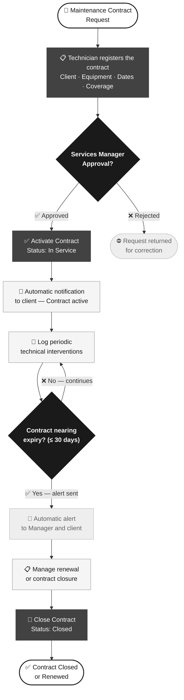
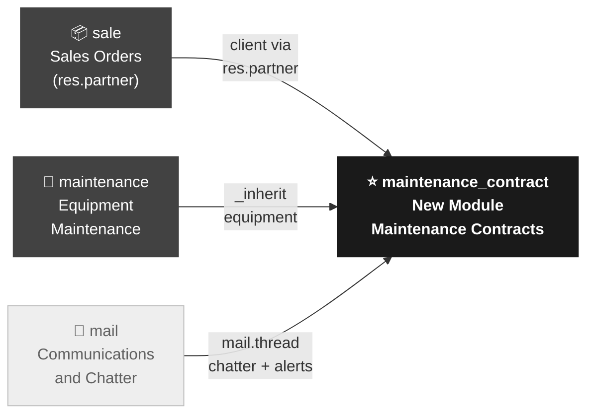

# Product Requirements Document (PRD) — Odoo Project

> 📌 **NOTE FOR THE AI**: This file is a complete enterprise example. Use it as a reference for structure, level of detail, and the expected Odoo vocabulary. The `📌 NOTE` blocks are guides for you; do NOT include them in PRDs you generate for the user.

---

## 1. Project Overview

- **Project Name:** Maintenance Contract Management System
- **Target Odoo Version:** 17.0
- **Instance Type:** Enterprise
- **Prepared by:** Senior Functional Consultant — After-Sales Services
- **Date:** 2026-03-21
- **Document Version:** 1.0 — Draft for client approval
- **Primary Objective:** Design and implement a custom module (`maintenance_contract`) that centralizes and digitalizes the complete lifecycle of periodic technical service contracts for industrial equipment. The current process is managed through spreadsheets, causing information loss, expired contracts without alerts, and delays in service billing.
- **Odoo Context Modules:** `sale`, `maintenance`, `mail`

---

## 2. Stakeholders and Odoo Roles

- **Client / Business Approver:** After-Sales Services Manager
- **Odoo Technical Lead:** Odoo Developer Assigned to the Project

**End Users by Role:**

> 📌 **NOTE**: Always map client roles to real Odoo `res.groups`. For new roles, indicate the group name that will be created in the module.

| Business Role | Odoo Group (`res.groups`) | Main Actions |
|---|---|---|
| Service Technician | `maintenance.group_equipment_user` | View assigned contracts, log technical interventions, update equipment status |
| Services Manager | `maintenance.group_equipment_manager` | Approve and close contracts, access the tracking dashboard, generate reports |
| Administrator | `base.group_system` | Module configuration, user group management, system parameters |

---

## 3. Functional Requirements

> 📌 **NOTE**: The RF-XX table is the heart of the PRD. Each row will become one or more sub-tasks in the RFC. Implementation types are: **Config** (no code), **Custom** (new module from scratch), **Extension** (inheritance with `_inherit`).

| ID | Requirement Name | Odoo Module | Type | Description |
|---|---|---|---|---|
| RF-01 | Maintenance Contract Registration | `maintenance` | Custom | Register periodic service contracts linked to equipment (`maintenance.equipment`) and clients (`res.partner`). Each contract includes: validity dates, service coverage, responsible technician, and commercial terms. |
| RF-02 | Contract Lifecycle | `maintenance` | Custom | Manage the contract state flow: **Draft → Confirmed → In Service → Closed**. Transitions are role-controlled: only the Manager can confirm and close; the Technician can log interventions when the contract is In Service. |
| RF-03 | Automatic Expiry Alerts | `mail` | Custom | Send automatic email notifications to the Services Manager and the client when a contract is nearing expiry (30 days before the end date). Alerts use a standardized mail template from `mail.template`. |
| RF-04 | Active Contract Tracking Dashboard | `maintenance` | Extension | Kanban view grouped by contract state, with visual expiry indicators (green: active, yellow: expiring soon, red: expired). Accessible to the Manager from the main Maintenance menu. |
| RF-05 | Technical Intervention History | `maintenance` | Custom | Record each technical intervention performed under the contract: date, responsible technician, work description, time spent, and resolution. Interventions are One2many lines of the main contract. |

**Implementation types:**
- **Config**: Native Odoo configuration without code development
- **Custom**: New Python/XML module developed from scratch (`_name`)
- **Extension**: Inheritance of existing module via `_inherit`

**Business Process Diagram — As-Is → To-Be:**

> 📌 **NOTE**: This diagram shows the business process the module will digitalize. Always use `flowchart TD` with the grayscale palette and emojis as visual guides. Business language (not technical).

---

## 4. Odoo Ecosystem Impact

> 📌 **NOTE**: This section is critical. Always name models using the `module.model_name` convention. The dependency diagram helps the technical team understand the scope before architecture.

- **Affected Base Modules:** `sale`, `maintenance`, `mail`
- **Required OCA Modules:** None in this phase
- **New Data Models:** Yes
  - `maintenance.contract` — Main maintenance contract model
  - `maintenance.contract.line` — Technical intervention lines (One2many of the contract)
- **Existing Model Inheritances:** `maintenance.equipment` (`_inherit` — add `contract_ids` field to link equipment to contracts)
- **Deployment Type:** New installable module `maintenance_contract`

**Module Dependency Map:**

> 📌 **NOTE**: Use `graph LR` for module diagrams (left → right). The new module stands out with `classDef nuevo` (black/white), existing ones with `classDef existente` (dark gray).

---

## 5. Non-Functional Requirements

### 5.1 Security and Odoo Permissions

> 📌 **NOTE**: This table becomes directly the `security/ir.model.access.csv` file during development. Be explicit with each permission; never leave ambiguous cells.

**Model-Level Access (`ir.model.access.csv`):**

| Model | Group | Read | Create | Write | Delete |
|---|---|---|---|---|---|
| `maintenance.contract` | `maintenance.group_equipment_user` | ✅ | ✅ | ✅ | ❌ |
| `maintenance.contract` | `maintenance.group_equipment_manager` | ✅ | ✅ | ✅ | ✅ |
| `maintenance.contract.line` | `maintenance.group_equipment_user` | ✅ | ✅ | ✅ | ❌ |
| `maintenance.contract.line` | `maintenance.group_equipment_manager` | ✅ | ✅ | ✅ | ✅ |

- **Record Rules (`ir.rule`):** Yes — The Service Technician can only view and edit contracts where they are the responsible technician (`domain_force: [('technician_id', '=', user.id)]`). The Manager sees all contracts without record restrictions.
- **Multi-company:** Yes — The `maintenance.contract` model includes a `company_id` field for multi-company support.

### 5.2 Performance and Technical Constraints

- **Estimated record volume:** ~300 active simultaneous contracts, ~1,500 technical interventions per year
- **External integrations:** None in this phase (manual billing from `sale.order`)
- **Module compatibility:** Odoo 17.0 Enterprise; requires `maintenance` and `mail` modules installed and configured

---

## 6. Out of Scope

> 📌 **NOTE**: This section is as important as the scope itself. It prevents false expectations and uncontrolled change requests. Always list at least 3 items.

- **Automatic billing from contracts**: Invoice generation from maintenance contracts is managed manually from `sale.order`. Deferred to Phase 2.
- **Customer portal for contract inquiry**: Client access to the Odoo portal to view their contracts is deferred to Phase 2.
- **Integration with external ticketing system**: Integration with external helpdesk platforms is not included in this phase.
- **Electronic signature module for contract approval**: Approval is recorded within the system via state change; digital signature is not included.
- **Mobile application for field technicians**: Mobile access is via the Odoo responsive web browser, not a native app.

---

## 7. Risks and Assumptions

### Odoo Technical Risks

- **Data Migration:** No `pre_init_hook` or `post_init_hook` script required. Historical contracts recorded in spreadsheets will be manually loaded by the functional team during the go-live phase.
- **Module Conflicts:** Verify compatibility with the OCA module `maintenance_plan` if installed in the client's environment, as both extend the `maintenance.equipment` model.
- **Version Upgrade:** The development follows OCA v17 standards; no breaking changes are anticipated in the defined models for a future upgrade to Odoo 18.0.
- **Adoption Risks:** 4 hours of training is required for Service Technicians and 2 hours for Managers. The process change (from spreadsheets to Odoo) may generate initial resistance.

### Business Risks

- The client must commit to providing the complete, up-to-date list of active equipment before development starts (blocker for RF-01).
- The Services Manager's availability for acceptance testing sessions must be confirmed at least 2 weeks in advance.

### Assumptions

- It is assumed that the client has Odoo 17.0 Enterprise active in production, with the `sale` and `maintenance` modules installed and correctly configured.
- It is assumed that the client will provide SSH access and administrator credentials to the development/staging environment for installation and acceptance testing.
- It is assumed that the assigned technical team has experience in Odoo v17 development.

---

## 8. Success Criteria (KPIs)

### Business KPIs

- **70%** reduction in average time to register a new maintenance contract (from 45 minutes manually → 13 minutes in Odoo).
- **100%** of contracts nearing expiry are automatically detected and alerted by the system (RF-03), eliminating the ~8 expired contracts per quarter that currently go unnoticed.
- **90%** of Service Technicians actively using the module to log interventions during the first 4 weeks post-deployment.

### Odoo Technical KPIs

- [ ] Module installs without errors: `odoo-bin -c odoo.conf -i maintenance_contract --stop-after-init`
- [ ] 0 critical errors or warnings in the Odoo log during and after installation
- [ ] Unit test coverage (`TransactionCase`) ≥ 80% over business logic (state lifecycle, expiry alerts, record rules)
- [ ] Contract list view load time < 2 seconds with 300 active records
- [ ] Security rules (`ir.rule`) manually verified with Technician profile (sees only their contracts) and Manager profile (sees all)

---

> **Approval Note:** This PRD must be formally reviewed and approved by the After-Sales Services Manager and the Odoo Technical Lead listed in §2. Any scope changes after approval must be managed through the project's formal change control process.
