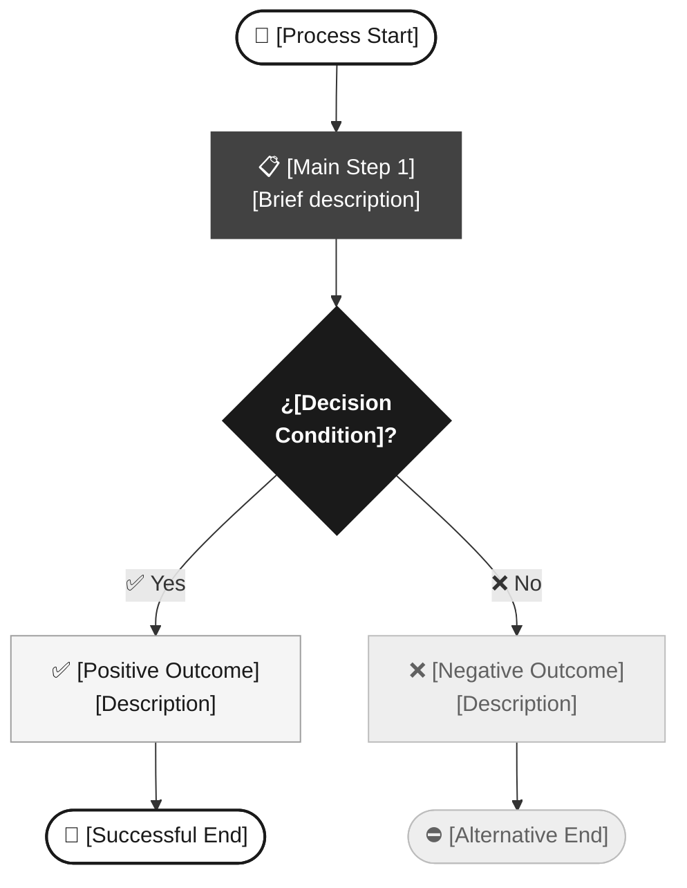
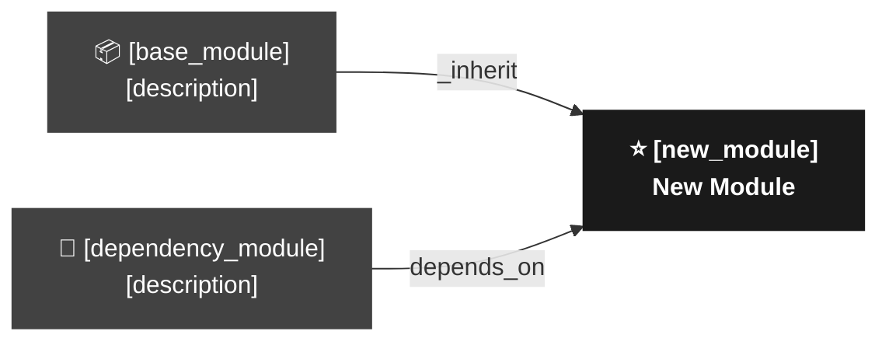

# Product Requirements Document (PRD) — Odoo Project

## 1. Project Overview

- **Project Name:** [Descriptive title of the module or customization]
- **Target Odoo Version:** [e.g. 17.0 / 18.0]
- **Instance Type:** [Community / Enterprise]
- **Prepared by:** [Functional Consultant / Project Manager name]
- **Date:** [YYYY-MM-DD]
- **Document Version:** [e.g. 1.0 — Draft / 1.1 — Revised]
- **Primary Objective:** [2 lines: what business process is improved and through what change in Odoo].
- **Odoo Context Modules:** [Already installed modules that frame the development. e.g: `sale`, `account`, `maintenance`]

---

## 2. Stakeholders and Odoo Roles

- **Client / Business Approver:** [Name and title of the person responsible for approving this PRD]
- **Odoo Technical Lead:** [Name of the assigned developer or technical consultant]

**End Users by Role:**

| Business Role | Odoo Group (`res.groups`) | Main Actions |
|---|---|---|
| [e.g. Service Technician] | [`module.group_role_user`] | [View records, create, edit own] |
| [e.g. Area Manager] | [`module.group_role_manager`] | [Approve, close, access reports] |
| [e.g. Administrator] | [`base.group_system`] | [Full module configuration] |

---

## 3. Functional Requirements

> For each RF, identify the affected Odoo module and the type of implementation required.

| ID | Requirement Name | Odoo Module | Type | Description |
|---|---|---|---|---|
| RF-01 | [Clear, concise name] | [`module`] | [Config / Custom / Extension] | [What the system must do] |
| RF-02 | [Clear, concise name] | [`module`] | [Config / Custom / Extension] | [What the system must do] |
| RF-03 | [Clear, concise name] | [`module`] | [Config / Custom / Extension] | [What the system must do] |

**Implementation types:**
- **Config**: Native Odoo configuration without code (enable options, define products, etc.)
- **Custom**: New Python/XML module developed from scratch
- **Extension**: Inheritance of existing module via `_inherit`

**Business Process Diagram (As-Is → To-Be):**

---

## 4. Odoo Ecosystem Impact

- **Affected Base Modules:** [e.g. `sale`, `maintenance`, `mail`]
- **Required OCA Modules (if applicable):** [e.g. `sale_order_type` — OCA/sale-workflow. If not applicable: None]
- **New Data Models:** [Yes / No — if Yes, specify name: `module.model_name`]
- **Existing Model Inheritances:** [e.g. `maintenance.contract` inherits from `sale.order` via `_inherit`. If not applicable: None]
- **Deployment Type:** [New installable module / Patch on existing module]

**Module Dependency Map:**

---

## 5. Non-Functional Requirements

### 5.1 Security and Odoo Permissions

**Model-Level Access (`ir.model.access.csv`):**

| Model | Group | Read | Create | Write | Delete |
|---|---|---|---|---|---|
| `module.model_name` | `module.group_role_user` | ✅ | ✅ | ✅ | ❌ |
| `module.model_name` | `module.group_role_manager` | ✅ | ✅ | ✅ | ✅ |

- **Record Rules (`ir.rule`):** [Yes / No — if Yes, describe the isolation: e.g. "The Technician only sees records assigned to their user (`user_id = uid`)"]
- **Multi-company:** [Yes / No — if Yes, indicate whether `company_id` is required on the model]

### 5.2 Performance and Technical Constraints

- **Estimated record volume:** [e.g. ~500 active records in the main model]
- **External integrations:** [API, webhooks, or None]
- **Module compatibility:** [Minimum Odoo version and required OCA or Enterprise modules]
- **Additional constraints:** [Expected response times, hardware constraints, etc. If not applicable: None]

---

## 6. Out of Scope

- [Item 1: functionality the client might expect but will NOT be implemented in this phase]
- [Item 2: integration or complementary module deferred to a later phase]
- [Item 3: report customization, customer portal, etc. if not part of this scope]

---

## 7. Risks and Assumptions

### Odoo Technical Risks

- **Data Migration:** [Is a `pre_init_hook` or `post_init_hook` script required? If not: "No existing data migration required"]
- **Module Conflicts:** [Modules installed in the client's environment that could conflict with the planned changes]
- **Version Upgrade:** [Does this development block or complicate a future upgrade to the next Odoo version?]
- **Adoption Risks:** [Training required for users, process changes that need to be managed]

### Business Risks

- [Scope risk, client availability, external dependencies, etc.]

### Assumptions

- [e.g. It is assumed that the client has an active Enterprise license in production]
- [e.g. The production database has `sale` and `maintenance` modules installed]
- [e.g. The technical team has administrator access to the development environment]

---

## 8. Success Criteria (KPIs)

### Business KPIs

- [e.g. X% reduction in registration time for [business process]]
- [e.g. Elimination of [N] manual steps in the [process] flow]
- [e.g. [N] users adopting the new module within the first [X] weeks]

### Odoo Technical KPIs

- [ ] Module installs without errors: `odoo-bin -c odoo.conf -i [module_name] --stop-after-init`
- [ ] 0 critical errors or warnings in the Odoo log during installation
- [ ] Unit test coverage (`TransactionCase`) ≥ 80% over custom business logic
- [ ] Main list view load time < 2 seconds with the estimated record volume
- [ ] Security rules (`ir.rule`) manually verified with each user profile defined in §2

---

> **Approval Note:** This PRD must be formally reviewed and approved by the Stakeholders listed in §2 before proceeding to the Technical Architecture phase (RFC). Once approved, any scope changes must be managed through a formal change control process.
