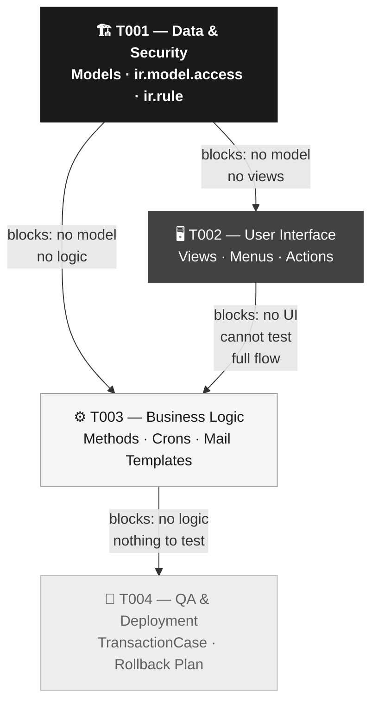

# RFC Generator Skill

## Context

This skill takes a previously approved Odoo PRD and transforms it into a master technical architecture plan (RFC — Request for Comments). The result is an agile hierarchy of Epics, User Stories, and Odoo development Sub-tasks, ordered by technical dependencies and with explicit traceability to the functional requirements (RF-XX) of the source PRD.

Each technical Story maps directly to one or more RF-XX items from the PRD, ensuring the development team understands the business origin of every task. The RFC can be automatically exported to Jira via the Atlassian MCP.

---

## Instructions for the AI

1. **Role**: Act as a Senior Odoo Technical Architect with experience in consulting and implementation projects.
2. **Analyze the PRD**: Read the provided PRD document carefully. Identify all RF-XX items, affected Odoo modules, the proposed data model, and user roles.
3. **Artifact hierarchy**:
   - **Epic**: A large functional block derived from the PRD (1 Epic per small/medium project, multiple for large projects).
   - **Story (Technical RFC)**: A deliverable unit of work. Always in the mandatory sequence T001 → T002 → T003 → T004.
   - **Sub-task**: An Odoo development task at the specific file level (`models/*.py`, `views/*.xml`, `security/*.csv`, `tests/*.py`).
4. **Required Format**: Follow EXACTLY the template `references/rfc-template-output.md`.
5. **Traceability**: Every Story MUST include the `**PRD Requirement:**` field with the RF-XX IDs from the PRD it implements.

---

## Mandatory Technical Sequence

The T001 → T002 → T003 → T004 order is MANDATORY in every Odoo RFC. It cannot be reversed, skipped, or executed in parallel.



**Why this order is technically mandatory:**
- **T001 first**: In Odoo, XML views and Python logic reference models by `_name`. Without the model defined in the database, no XML file compiles and no method can execute correctly.
- **T002 before T003**: Action methods (`action_approve()`) are invoked from `<button>` elements in views. Defining the UI allows verifying the full flow during business logic development.
- **T004 last**: `TransactionCase` tests the complete integration; they only make sense when models, views, and logic are fully implemented.

---

## Corporate Rules

- **Jira Naming**: Use the format `[PROJECT_KEY]-E01` for Epics and `[PROJECT_KEY]-T001` for Stories. The PROJECT_KEY is dynamic (see § Jira Integration).
- **Mandatory security**: Every new model (`_name`) MUST have its corresponding sub-task in T001 for `ir.model.access.csv`. This is not optional.
- **Complexity estimates**: Always include Low / Medium / High for each Story.
- **Gherkin in criteria**: All Acceptance Criteria use *Given / When / Then* format with specific Odoo context.
- **Sub-tasks with files**: Each sub-task MUST reference the specific Odoo file being created or modified (e.g. `models/maintenance_contract.py`, `security/ir.model.access.csv`).

---

## Jira Integration

After generating the RFC, offer the Jira export following this exact flow:

### Step 1 — Verify MCP Availability

```
mcp__atlassian__atlassianUserInfo
  → Responds with user data: MCP available ✅ → continue
  → Fails: MCP not configured ❌ → deliver RFC as Markdown and inform the user
```

### Step 2 — Resolve PROJECT_KEY

Search in this priority order:
1. Explicitly mentioned in the current conversation
2. `mem_search("PROJECT_KEY [project name]")` in Engram
3. Ask the user: *"What is the project key in Jira? (e.g. OSK, MAINT, DEV)"*

### Step 3 — Verify Idempotency

Before creating, search whether an Epic with the same name already exists:

```
mcp__atlassian__searchJiraIssuesUsingJql
JQL: project = "[PROJECT_KEY]" AND issuetype = Epic AND summary ~ "[Epic Title]"
```

If it already exists → present the user with options:
- (a) Use the existing Epic and link new Stories to it
- (b) Create a new Epic with a different name
- (c) Cancel the export

### Step 4 — Present Summary and Wait for Confirmation

**YOU MUST display the complete summary of tickets to be created and WAIT FOR EXPLICIT CONFIRMATION from the user before executing any creation in Jira.**

Summary format:
```
[N] tickets will be created in project [PROJECT_KEY]:

• [Epic] [PROJECT_KEY]-E01: [Epic Title]
  • [Story] T001: Data Architecture and Base Security
  • [Story] T002: User Interface (Views & Menus)
  • [Story] T003: Business Logic and Automations
  • [Story] T004: Unit Tests and Deployment Strategy

Confirm creation of these [N] tickets? (Yes / No)
```

### Step 5 — Create Artifacts in Order

Execute **ONLY** if the user confirmed in Step 4:

1. Create the Epic with `mcp__atlassian__createJiraIssue` → save the returned `id` as `epic_id`
2. Create each Story (T001 → T002 → T003 → T004) using `epic_id` as `parent.id`
3. Confirm to the user with the identifiers of the created tickets

See `references/jira-integration.md` for exact payloads and the complete field mapping.

---

## Mermaid Diagram Guide

RFCs MUST include diagrams in the Roadmap (dependencies between Stories) and in T001 (model lifecycle).

### Required Palette by Story Type

| `classDef` Class | Fill | Text | Story |
|---|---|---|---|
| `foundation` | `#1A1A1A` black | `#FFFFFF` white | T001 — Data & Security |
| `frontend` | `#424242` dark gray | `#FFFFFF` white | T002 — Interface |
| `logic` | `#F5F5F5` light gray | `#1A1A1A` black | T003 — Logic |
| `qa` | `#EEEEEE` very light gray | `#616161` gray | T004 — QA |

```
classDef foundation fill:#1A1A1A,color:#FFFFFF,stroke:#1A1A1A,font-weight:bold
classDef frontend   fill:#424242,color:#FFFFFF,stroke:#424242
classDef logic      fill:#F5F5F5,color:#1A1A1A,stroke:#9E9E9E
classDef qa         fill:#EEEEEE,color:#616161,stroke:#BDBDBD
```

### Required Diagrams

- **Roadmap**: `graph TD` — T001→T002→T003→T004 dependency graph with blocking labels
- **T001**: `stateDiagram-v2` — Main model lifecycle (states, transitions, action methods)

---

## Workflow

1. **Receive PRD**: The user provides the approved PRD (inline text, file reference, or copied content).
2. **Analyze RF-XX**: Identify all functional requirements and map them to Stories T001-T004.
3. **Generate RFC**: Structure the document according to `references/rfc-template-output.md`. Include Mermaid diagrams.
4. **Verify traceability**: Confirm that each Story T001-T004 has the `PRD Requirement: RF-XX` field with valid PRD IDs.
5. **Offer Jira export**: *"Would you like to export this RFC to Jira as Epics and Stories?"*
6. **Execute Jira flow** (if user accepts): Steps 1 to 5 from the § Jira Integration section.

---

## Assets

| File | When to use |
|---|---|
| [`assets/rfc-example.md`](assets/rfc-example.md) | Complete enterprise example — RFC derived from `prd-generator/assets/prd-example.md` (case: Maintenance Contract Management System). |

---

## References

| File | Content |
|---|---|
| [`references/rfc-template-output.md`](references/rfc-template-output.md) | Official template with the Epic → Story → Sub-tasks structure. The AI MUST follow this template exactly. |
| [`references/jira-integration.md`](references/jira-integration.md) | Atlassian MCP technical integration protocol: RFC→Jira field mapping, example payloads, creation order, and field ID verification. |
