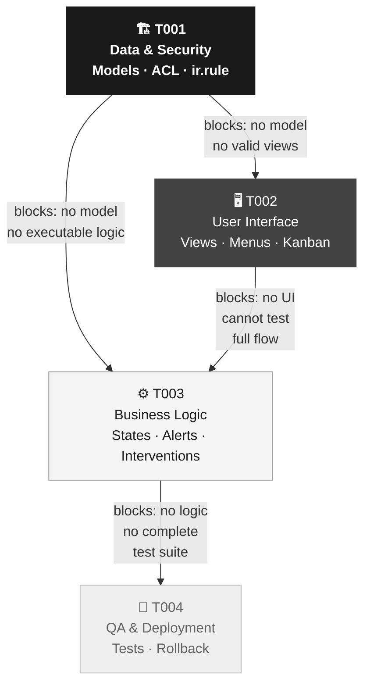
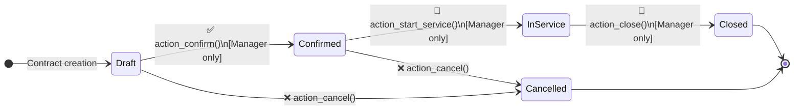

# Technical Architecture and RFCs (Execution Plan)

> **Source Document (PRD):** `skills/prd-generator/assets/prd-example.md` — Maintenance Contract Management System
> **RFC Version:** 1.0
> **Date:** 2026-03-21

> 📌 **NOTE FOR THE AI**: This file is a complete enterprise example showing how to transform an approved PRD into a technical Odoo RFC. The `📌 NOTE` blocks are guides for you; do NOT include them in RFCs you generate for the user.

---

## Implementation Roadmap

> 📌 **NOTE**: The roadmap explains the implementation order and its technical dependencies in language the technical team immediately understands. The following diagram is mandatory.

Epic E01 is implemented in a single sequential phase of 4 Stories. Story T001 (Data & Security) is the absolute starting point: without the models defined in the database, no XML file can compile and no Python method can execute. T002 (Interface) depends on T001. T003 (Business Logic) depends on T001 and T002 to test the complete flow through the UI. T004 (QA) only makes sense once the three previous layers are implemented.

**Story dependency graph:**

---

## [Epic] OSK-E01: Maintenance Contract Management Module

**Description:** Implement the `maintenance_contract` module in Odoo 17.0 Enterprise. The module manages the complete lifecycle of periodic technical service contracts: registration, approval, intervention execution, automatic expiry alerts, and closure. Derived from requirements RF-01 to RF-05 of the approved PRD.

---

### 📝 [Story / RFC] OSK-T001: Data Architecture and Base Security

> 📌 **NOTE**: T001 always covers models and security. The stateDiagram shows the main model lifecycle — it is the technical contract for the state flow before writing a single line of code.

- **PRD Requirement:** RF-01, RF-02
- **Dependencies:** None (mandatory starting point of the module)
- **Complexity:** Medium

**Acceptance Criteria (Gherkin):**
- *Given* I am the system administrator, *When* I install the module with `odoo-bin -c odoo.conf -i maintenance_contract --stop-after-init`, *Then* the tables `maintenance_contract` and `maintenance_contract_line` are created in the PostgreSQL database without errors in the log.
- *Given* I am a user with the **Service Technician** profile (`maintenance.group_equipment_user`), *When* I try to access the model `maintenance.contract`, *Then* I can only view, create, and edit contracts where `technician_id = uid`; I cannot delete records.
- *Given* I am a user with the **Services Manager** profile (`maintenance.group_equipment_manager`), *When* I access the model `maintenance.contract`, *Then* I see all contracts without record restrictions and have full CRUD permissions.

**`maintenance.contract` Model Lifecycle:**

**Technical Sub-tasks (Odoo Development):**
- [ ] `models/maintenance_contract.py` — Create model `maintenance.contract` with `_name`, `_description`, `_inherit = ['mail.thread', 'mail.activity.mixin']`, fields: `name`, `partner_id` (Many2one `res.partner`), `technician_id` (Many2one `res.users`), `equipment_ids` (Many2many `maintenance.equipment`), `date_start`, `date_end`, `state` (Selection), `company_id`, `line_ids` (One2many → `maintenance.contract.line`), `_sql_constraints` for uniqueness.
- [ ] `models/maintenance_contract_line.py` — Create model `maintenance.contract.line` (`_name = 'maintenance.contract.line'`) with fields: `contract_id` (Many2one), `date`, `technician_id`, `description`, `duration`, `resolution`.
- [ ] `models/maintenance_equipment.py` — Inherit `maintenance.equipment` (`_inherit = 'maintenance.equipment'`) to add field `contract_ids` (Many2many → `maintenance.contract`).
- [ ] `security/groups.xml` — The groups `maintenance.group_equipment_user` and `maintenance.group_equipment_manager` already exist in the `maintenance` module; verify they do not require redefinition.
- [ ] `security/ir.model.access.csv` — Add the 4 access lines (2 models × 2 groups) with the 8 required columns in the correct order: `id,name,model_id:id,group_id:id,perm_read,perm_write,perm_create,perm_unlink`.
- [ ] `security/ir_rule.xml` — Define rule `maintenance_contract_technician_rule` with `domain_force: [('technician_id', '=', user.id)]`, `groups: maintenance.group_equipment_user`, `noupdate="1"`.
- [ ] `__manifest__.py` — Register module with `'name': 'Maintenance Contract'`, `'version': '17.0.1.0.0'`, `'depends': ['maintenance', 'mail', 'sale']`, `'data'` in order: `security/ir.model.access.csv`, `security/ir_rule.xml`.

---

### 📝 [Story / RFC] OSK-T002: User Interface (Views & Menus)

> 📌 **NOTE**: T002 defines what the user sees on screen. The sub-tasks list the specific XML files. Each view references fields from the model defined in T001.

- **PRD Requirement:** RF-01, RF-04
- **Dependencies:** Blocked by OSK-T001
- **Complexity:** Medium

**Acceptance Criteria (Gherkin):**
- *Given* I am a user with module access, *When* I navigate to **Maintenance → Contracts → All Contracts**, *Then* I see the list view (`<list>`) with columns: Contract Name, Client, Responsible Technician, Start Date, End Date, Status.
- *Given* I am the **Services Manager**, *When* I access the **Maintenance → Contracts → Tracking Dashboard** menu, *Then* I see the Kanban view with contracts grouped by state and with visual expiry indicators (RF-04).

**Technical Sub-tasks (Odoo Development):**
- [ ] `views/maintenance_contract_views.xml` — Design:
  - `<form>` view with main fields in the header (name, client, technician, dates) and tabs: "Interventions" (One2many widget with `maintenance.contract.line`) and "Notes".
  - `<list>` view with columns: `name`, `partner_id`, `technician_id`, `date_start`, `date_end`, `state` (with decoration-danger for expired, decoration-warning for expiring soon).
  - `<search>` view with predefined filters: "Active", "Expiring Soon", "By Technician" and grouping by `state`.
- [ ] `views/maintenance_contract_kanban_views.xml` — Design `<kanban>` view for RF-04: cards with `name`, `partner_id`, `date_end`, visual expiry indicator (computed field `days_to_expiry`). Default grouping by `state`.
- [ ] `views/menu_items.xml` — Create:
  - `ir.actions.act_window` for contract list and for the tracking Kanban.
  - `ir.ui.menu`: entries under the **Maintenance** root menu → "Contracts" section → items "All Contracts" and "Tracking Dashboard".
- [ ] `__manifest__.py` — Add view files to the `'data'` key, after security files.

---

### 📝 [Story / RFC] OSK-T003: Business Logic and Automations

> 📌 **NOTE**: T003 is where the module's intelligence lives. The action methods implement the state transitions from T001's stateDiagram. The cron implements RF-03.

- **PRD Requirement:** RF-02, RF-03, RF-05
- **Dependencies:** Blocked by OSK-T001 and OSK-T002
- **Complexity:** High

**Acceptance Criteria (Gherkin):**
- *Given* a contract in **Draft** state, *When* the Manager clicks the "Confirm Contract" button, *Then* the state changes to **Confirmed** and the chatter logs the change with the user and timestamp (via `mail.thread`).
- *Given* a contract whose `date_end` is equal to or less than `today + 30 days`, *When* the daily `ir.cron` alert job runs, *Then* an email is sent to the Services Manager and the `partner_id` email using the `mail_template_contract_expiry` template.
- *Given* a contract in **In Service** state, *When* the Technician logs a new intervention in the "Interventions" tab, *Then* the `maintenance.contract.line` record is saved with `date`, `technician_id`, `description`, and `duration` filled in (RF-05).

**Technical Sub-tasks (Odoo Development):**
- [ ] `models/maintenance_contract.py` — Implement lifecycle action methods:
  - `action_confirm(self)`: validate that `date_start` and `date_end` are defined → change `state` to `'confirmed'` → log in chatter.
  - `action_start_service(self)`: change `state` to `'in_service'` → log in chatter.
  - `action_close(self)`: change `state` to `'closed'` → log in chatter.
  - `action_cancel(self)`: change `state` to `'cancelled'` → log in chatter.
  - `_compute_days_to_expiry(self)`: computed field (`@api.depends('date_end')`) that calculates remaining days for the RF-04 Kanban view.
  - `_cron_send_expiry_alerts(self)`: class method that searches contracts with `state = 'in_service'` and `date_end <= today + 30 days` → sends email via `mail.template`.
- [ ] `data/mail_template_contract_expiry.xml` — Create `mail.template` with:
  - `model_id`: `maintenance.contract`
  - `subject`: "⚠️ Maintenance Contract nearing expiry — {{ object.name }}"
  - `body_html`: Professional body with client name, validity dates, responsible technician, and link to the contract in Odoo.
  - `email_to`: `{{ object.partner_id.email }}` (client)
  - `email_cc`: Services Manager email (configured via system parameter)
- [ ] `data/ir_cron_contract_alerts.xml` — Create `ir.cron`:
  - `name`: "Maintenance Contract Expiry Alerts"
  - `model_id`: `maintenance.contract`
  - `code`: `model._cron_send_expiry_alerts()`
  - `interval_number`: 1 · `interval_type`: `'days'` · `active`: True
- [ ] `__manifest__.py` — Add `data/` files to the `'data'` key with `noupdate="1"` for the cron and mail template.

---

### 📝 [Story / RFC] OSK-T004: Unit Tests and Deployment Strategy (QA)

> 📌 **NOTE**: T004 validates that the three previous layers work correctly together. The TransactionCases cover the Gherkin scenarios from T001-T003. Always include the Rollback Plan.

- **PRD Requirement:** RF-01, RF-02, RF-03, RF-04, RF-05
- **Dependencies:** Blocked by OSK-T001, OSK-T002, and OSK-T003
- **Complexity:** Medium

**Acceptance Criteria (Gherkin):**
- *Given* the fully implemented `maintenance_contract` module, *When* tests are run with `odoo-bin -c odoo.conf --test-enable -i maintenance_contract --stop-after-init`, *Then* all `TransactionCase` tests pass without errors and business logic coverage is ≥ 80%.
- *Given* the module installed in the staging environment with test data, *When* the functional team verifies permissions with **Technician** and **Manager** profiles, *Then* the Technician only sees their contracts and cannot delete them; the Manager sees all and has full CRUD access.

**Technical Sub-tasks (Odoo Development):**
- [ ] `tests/__init__.py` — Import all test modules.
- [ ] `tests/common.py` — Class `MaintenanceContractCommon(TransactionCase)` with:
  - Test user setup: `user_technician` (with group `maintenance.group_equipment_user`) and `user_manager` (with group `maintenance.group_equipment_manager`).
  - Base data creation: `partner_test`, `equipment_test`, test contract in Draft state.
- [ ] `tests/test_maintenance_contract.py` — `TransactionCase` covering:
  - Contract creation with required fields.
  - Full state flow: Draft → Confirmed → In Service → Closed.
  - Constraint tests: Technician cannot confirm (Manager only); contract without dates cannot be confirmed.
  - `ir.rule` permission test: Technician only sees contracts assigned to them.
  - Intervention test: creation of `maintenance.contract.line` linked to the contract.
- [ ] `tests/test_contract_alerts.py` — `TransactionCase` covering:
  - Contract with `date_end = today + 25 days` is included by `_cron_send_expiry_alerts()`.
  - Contract with `date_end = today + 35 days` is NOT included.
  - Contract in `closed` state is NOT included even if nearing expiry.
- [ ] `__manifest__.py` — Verify that `'installable': True` and that there are no references to non-existent files in `'data'`.
- [ ] **Data Migration Plan:** No migration script required. Historical contracts are manually loaded by the functional team post-installation via the user interface.
- [ ] **Rollback Plan:** If the Production installation fails:
  1. Run `odoo-bin -c odoo.conf --uninstall-module maintenance_contract --stop-after-init`.
  2. Verify that the `maintenance_contract` and `maintenance_contract_line` tables have been removed from PostgreSQL.
  3. Restore the pre-installation backup if `--uninstall` is not sufficient.
  4. Notify the technical team with the full error log for root cause analysis.

---

> 📌 **FINAL NOTE**: Observe the coherence between this RFC and `prd-example.md`: the same models (`maintenance.contract`, `maintenance.contract.line`), the same base modules (`sale`, `maintenance`, `mail`), the same roles, and each Story references the corresponding RF-XX from the PRD. This traceability is mandatory in all generated RFCs.
