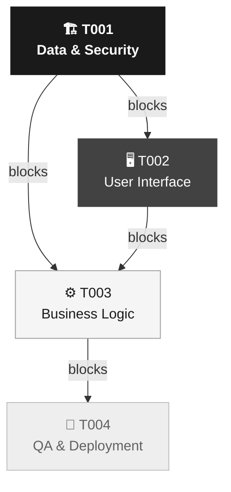
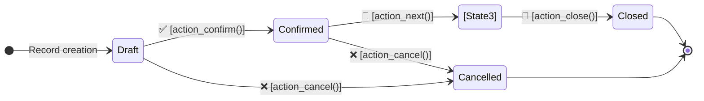

# Technical Architecture and RFCs (Execution Plan)

> **Source Document (PRD):** [Path or name of the approved PRD — e.g. `assets/prd-example.md` or document title]
> **RFC Version:** [e.g. 1.0]
> **Date:** [YYYY-MM-DD]

---

## Implementation Roadmap

[Briefly explain the implementation order and critical dependencies. e.g: "Epic 1 must be completed first because it contains the base models on which all views and business logic depend."]

**Story dependency graph:**

---

## [Epic] [PROJECT_KEY]-E01: [Title of the Major Functional Block]

**Description:** [High-level technical summary of the Epic, derived directly from the source PRD].

---

### 📝 [Story / RFC] [PROJECT_KEY]-T001: Data Architecture and Base Security

- **PRD Requirement:** [RF-01, RF-02]
- **Dependencies:** None (mandatory starting point).
- **Complexity:** [Low / Medium / High]
- **Acceptance Criteria (Gherkin):**
  - *Given* I am the administrator, *When* I install the module with `odoo-bin -i [module]`, *Then* the `[new.model]` tables are created in the database without errors.
  - *Given* I am a user with role "[User Role]", *When* I try to access the model `[new.model]`, *Then* I can only [read/create/edit] according to the permissions defined in `ir.model.access.csv`.
  - *Given* I am a user with role "[User Role]", *When* I view the list, *Then* I only see the records that belong to me (according to the configured `ir.rule`).

**Model Lifecycle Diagram:**

- **Technical Sub-tasks (Odoo Development):**
  - [ ] `models/[model_name].py`: Create the model `[new.model]` with `_name`, `_description`, `_inherit` (if applicable), fields, and `_sql_constraints`.
  - [ ] `security/groups.xml`: Define `ir.module.category` and `res.groups` groups (User and Manager).
  - [ ] `security/ir.model.access.csv`: Add CRUD permissions per group with the 8 required columns.
  - [ ] `security/ir_rule.xml`: (If applicable) Add record rules with `domain_force` and `noupdate="1"`.
  - [ ] `__manifest__.py`: Register the module with dependencies, `data` files in correct order (groups → csv → rules).

---

### 📝 [Story / RFC] [PROJECT_KEY]-T002: User Interface (Views & Menus)

- **PRD Requirement:** [RF-01, RF-XX]
- **Dependencies:** Blocked by [PROJECT_KEY]-T001.
- **Complexity:** [Low / Medium / High]
- **Acceptance Criteria (Gherkin):**
  - *Given* the user has access permissions, *When* they navigate to the "[Menu Name]" menu, *Then* they see the list view (`<list>`) with the model's key fields.
  - *Given* the user opens a record from the list, *When* the form view loads, *Then* all fields defined in the PRD are visible according to the user's role.
- **Technical Sub-tasks (Odoo Development):**
  - [ ] `views/[name]_views.xml`: Design `<form>` view, `<list>` view, `<search>` view with filters and groupings.
  - [ ] `views/menu_items.xml`: Create `ir.actions.act_window` and `ir.ui.menu` structure (root → section → item).
  - [ ] (If applicable) `views/kanban_views.xml`: Kanban view for visual state tracking.

---

### 📝 [Story / RFC] [PROJECT_KEY]-T003: Business Logic and Automations

- **PRD Requirement:** [RF-02, RF-03, RF-XX]
- **Dependencies:** Blocked by [PROJECT_KEY]-T001 and [PROJECT_KEY]-T002.
- **Complexity:** [Low / Medium / High]
- **Acceptance Criteria (Gherkin):**
  - *Given* a record in "Draft" state, *When* the user clicks "[Action]", *Then* the state changes to "[New State]" and the change is logged in the chatter (`mail.thread`).
  - *Given* [business condition] is met, *When* the system runs the `ir.cron`, *Then* an automatic notification is sent to [recipient] via the defined mail template.
- **Technical Sub-tasks (Odoo Development):**
  - [ ] `models/[model_name].py`: Implement action methods (`action_[name]()`), business constraints (`@api.constrains`), and computed fields (`@api.depends`).
  - [ ] `data/mail_template.xml`: (If applicable) Create mail template for automatic notifications.
  - [ ] `data/ir_cron.xml`: (If applicable) Define scheduled task `ir.cron` with method and frequency.

---

### 📝 [Story / RFC] [PROJECT_KEY]-T004: Unit Tests and Deployment Strategy (QA)

- **PRD Requirement:** [RF-01, RF-02, RF-03, RF-XX]
- **Dependencies:** Blocked by [PROJECT_KEY]-T001, T002, and T003.
- **Complexity:** [Low / Medium / High]
- **Acceptance Criteria (Gherkin):**
  - *Given* the fully implemented module, *When* tests are run with `odoo-bin -c odoo.conf --test-enable -i [module] --stop-after-init`, *Then* all `TransactionCase` tests must pass without errors.
  - *Given* the module installed in the staging environment, *When* permissions are verified with each role defined in PRD §2, *Then* each role has access exclusively to the actions assigned to them.
- **Technical Sub-tasks (Odoo Development):**
  - [ ] `tests/common.py`: Base class `TestCommon` with test user setup for each role defined in the PRD.
  - [ ] `tests/test_[model_name].py`: `TransactionCase` covering: record creation, state transitions, business constraints, role permissions.
  - [ ] `tests/test_[logic_name].py`: (If applicable) Specific tests for complex business logic (crons, calculations, integrations).
  - [ ] **Data Migration Plan:** [Specify whether `pre_init_hook` / `post_init_hook` is required or confirm it does not apply].
  - [ ] **Rollback Plan:** Identify the steps to safely uninstall the module if the Production installation fails.

---

[Repeat the Epic → T001...T004 hierarchy for each additional functional block as dictated by the PRD...]
